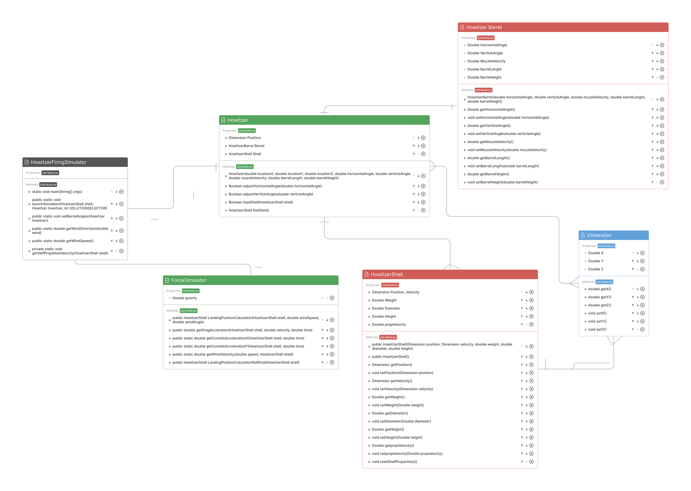
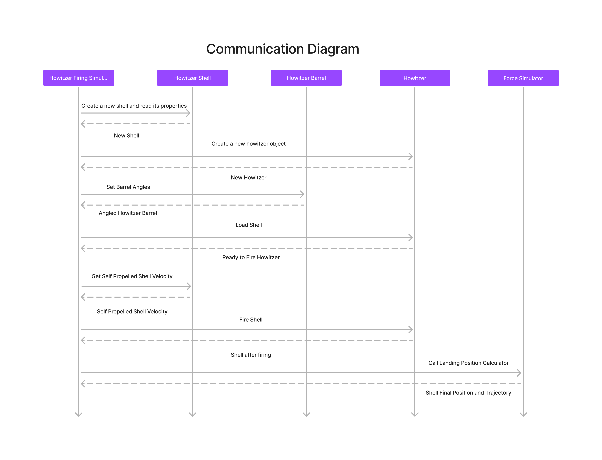
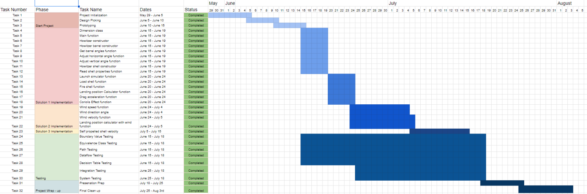

## Project Planning

### Project Prototyping

Before coding our project, we did some planning. We created a class diagram and a communication diagram which can be found in the documents folder. These were vital in making sure that we used our time effectively, we weeded out any obvious logical errors with these diagrams and it helped keep our project code organized. 

Image of Class Diagram:

Image of Communication Diagram: 

### Group Organization

To keep our group organized and on track, we created a Gnatt chart. The chart can be seen below as well as found in the Documents folder. We updated the gnat chart anytime a task could be broken down and gave ourselves deadlines to complete parts of the project, overall this helped greatly in managing our time effectively.

Image of Gnatt Chart:
